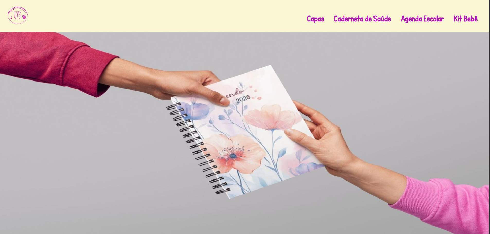

<h1 align="center">✨ Catálogo TB Paper Artesanal ✨</h1>

  <em>Encadernação artesanal • Design exclusivo • Feito à mão com amor</em>

  

---

  O <strong>Catálogo TB Paper Artesanal</strong> foi criado para apresentar os produtos da loja de forma simples, elegante e responsiva. 
  Desenvolvido com <strong>HTML, CSS e JavaScript</strong>, é um projeto leve e fácil de atualizar, perfeito para mostrar o trabalho artesanal com estilo.

  
  
  

---

### 🧵 Sobre o Projeto

- 🖼️ Exibição de produtos com imagem, nome e descrição  
- 📱 Layout responsivo e ad
